对于刚接触C语言的学习者来说，最容易混淆的一点是什么时候该用值类型，什么时候该用指针类型。本文尝试用一个简化的模型来解释值和指针。

## 预备知识 栈空间(stack)和堆（heap)空间

1. 这里说的 栈 不是数结构里的栈（后进先出的系列), 堆也不是数据结构里的 堆(顶部元素最小(或最大)). 这里说的栈是函数调用时进程自动为函数分配的空间，函数调用结束立即释放。堆是由程序显示申请的空间，也需要程序显示的释放，否则在进程生命期一直有效。这样说可能还是有些抽象，我们用代码和图形来说明一下。

```c
  1 #include <stdio.h>
  2
  3 int add( int a, int b ) {
  4     int c;
  5     c = a + b;
  6     return c;
  7 }
  8
  9 int main(int argc, char** argv) {
 10     int a = 100;
 11     int b = 200;
 12     int c ;
 13     c = add(a, b);
 14     return c;
 15 }
```

上述代码在Linux上编译后生成 a.out 可执行文件。(Windows上可能生成的是 a.exe)。可以在命令行执行。

```shell
% ./a.out
```
<br/>
2. 当程序执行到第 `12` 行时，内存布局看起来是这样的（和实际进程相比做了大量简化）
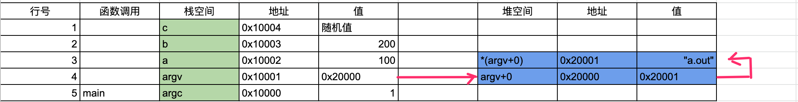</img>
栈空间是执行到那个函数应进程自动给这个函数分配空间，上图中，

1. 栈空间包函了main函数的形参 `argc` 和 `argv`, 局部变量 `a`, `b`, `c`。
2. 其中 argv是 `char**`类型，是一个二级指针，第一级指向一个`char*`的指针, 第二级指向实际的字符串。因为没有命令行参数，所以argv只包含命令行本身 `a.out`。
3. `c` 没有初始化，是当时内存里任何值（这是C/C++的行为，其它语言一般会初始化为`0`）
<br/>
3. 当执行到第`6`行时，内存布局看起来是这样的（和实际进程相比做了大量简化）
    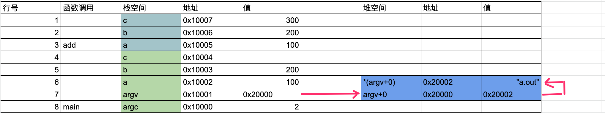</img>

可以看到，虽然函数 `add` 的形参 `a`, `b`，和main函数调用传递的 局部变量 `a`, `b` 名称相同， 但是它们在栈空间中有各自的地址，完全是不同的。第`13`行的函数调用，把参数复制了一份。**这是理解值传递和指针传递的关键**。第`3`行 `add`函数定义里的 `a`， `b` 叫做**形参**， 是在 add函数调用的时分配在add的帧栈上的（后文解释为什么称为`帧`）， 第`13`函数调用时，传递的main函数中的`a`, `b`叫做**实参** ， 实参到形参的拷贝一定是发生在栈空间的值传递，和参数是不是指针无关。
<br/>
4. 当执行到第`14`行时，内存布局看起来是这样的（和实际进程相比做了大量简化） 
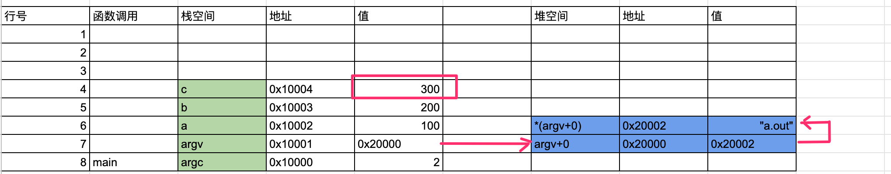</img>
可以看到 `add`函已执行完毕，所有容间都释放了，返回值保存到了 `main`函数的局部变量`c`中。

<br/>
5. 看一个极端的例子，为什么函数调用分配的栈空间也叫`帧栈`。 我们更新一下`add` 方法。代码如下，增加了第`5`至`7`行。 这个代码很无厘头，但是我们重点看一下它的执行过程。

```c
  1 #include <stdio.h>
  2
  3 int add( int a, int b ) {
  4     int c;
  5     if ( c < 900 ) {
  6         c = add(c , b)
  7     }
  8     return c;
  9 }
 10
 11 int main(int argc, char** argv) {
 12     int a = 100;
 13     int b = 200;
 14     int c ;
 15     c = add(a, b);
 16     return c;
 17 }
```
<br/>
6. 当执行到第`8`行时，内存布局看起来是这样的（和实际进程相比做了大量简化） 
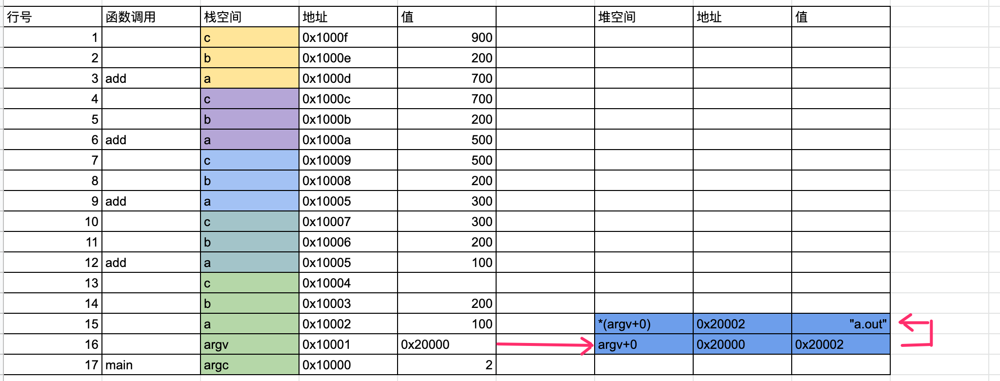</img>
由于第`5`行的判断，`add`被递归地调用了多次。每次调用都会分配一个新的栈空间。


<br/>
7. 当执行到第`16`行时，内存布局看起来是这样的（和实际进程相比做了大量简化） 
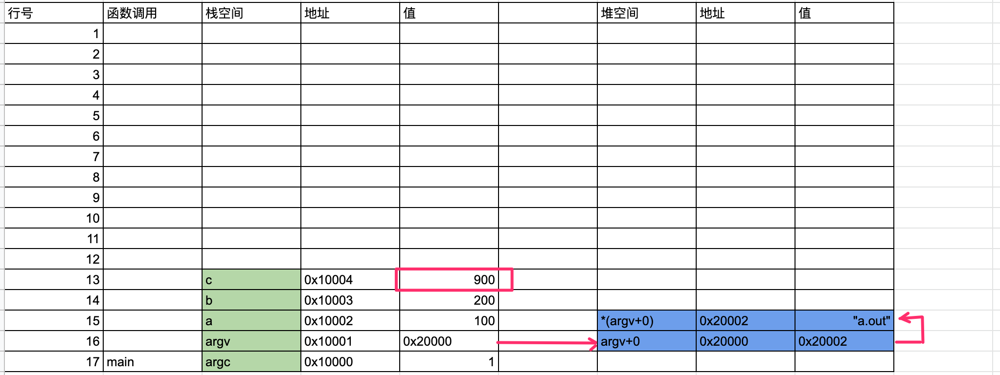</img>

<br/>
8. 通过 `图6` 和`图7`的过程看，栈是在一个连续空间上分配，后分配的先释放，像数据结构中的`栈`一样，这是它们都称为`栈`。 分配的块是连续的，像电影胶片一样，所以称为`帧`。 

栈上实间分配，编译时就确定了形参和局部变量所需要的总大小，然后在相邻的空间增长一块。这种分配和回收的速度非常快。然后函数执行完就收回，过程是自动的，永远也不会内存漏。当然，就像上面的函数递归调用，如果没有控制好条件，递归次数太多，也会耗尽栈空间。

而堆空间需要显式分配，显式回收， C语言中是 malloc/free, C++中是new/delete。 可以长期保存，不受函数的调用手命期的影响，长期有效。但如果忘记释入，会内存泄露。另外如果返回的分配和回收不同大小的对象，堆上会产生碎片空间，分配和回收的速度变慢。

## 值传递和指针传递

1. 有了前面的预备知识，我们来看一下如何保持函数内操作的值。有如下示例代码，`swap`函数交换 `a` 和 `b`的值。

```c
  1 #include <stdio.h>
  2
  3 void swap( int a, int b ) {
  4     int c;
  5     c = a;
  6     a = b;
  7     b = c;
  8     printf( "a=%d, b=%d\n", a, b );
  9 }
 10
 11 int main(int argc, char** argv) {
 12     int a = 100;
 13     int b = 200;
 14     swap( a, b );
 15     printf( "a=%d, b=%d\n", a, b );
 16 }
```

<br/>
2. 编译、执行这个程序我们会看到 第`8`行的输出 `a` 和 `b` 确实交换了， 但是第`15`行的输出`a`和`b`没有变化。
> a=200, b=100
> a=100, b=200

<br/>
3. 我们通过图示看一下栈空间，当程序执行到第`4`行时，内存布局看起来是这样的（和实际进程相比做了大量简化）
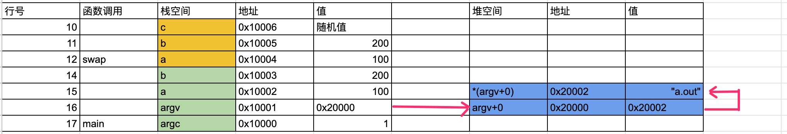</img>

<br/>
3. 我们通过图示看一下栈空间，当程序执行到第`8`行时，内存布局看起来是这样的（和实际进程相比做了大量简化）
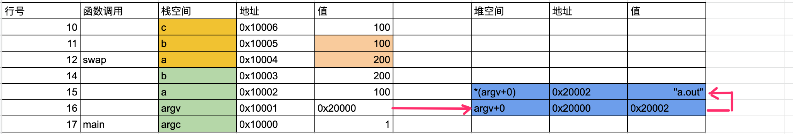</img>

可以看到swap函数内的局部变量`a`, `b`已经交换了。而main函数的`a`, `b`原封不动。

<br/>
4. 那么应该如何正确的实现交换呢，看如下代码, 这里将swap函数的形参类型改为指针，相应的第`13`行，调用方式改为传入`main`函数中局部变量`a`，`b`的地址：
```c
  1 #include <stdio.h>
  2
  3 void swap( int* a, int* b ) {
  4     int c;
  5     c = *a;
  6     *a = *b;
  7     *b = c;
  8     printf( "a=%d, b=%d\n", *a, *b );
  9 }
 10
 11 int main(int argc, char** argv) {
 12     int a = 100;
 13     int b = 200;
 14     swap( &a, &b );
 15     printf( "a=%d, b=%d\n", a, b );
 16 }
```

<br/>
5. 当程序执行到第`4`行时，内存布局看起来是这样的（和实际进程相比做了大量简化）
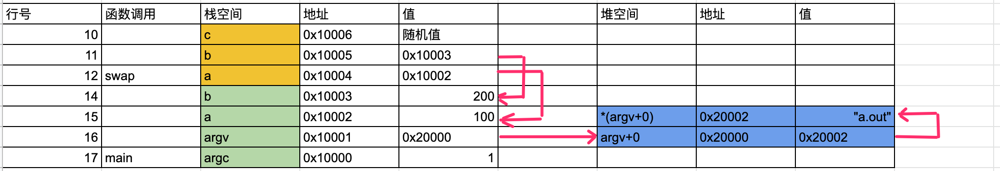</img>

可以看到swap函数内的局部变量`a`, `b`存储的不是值，而是指向`main`函数中`a`,`b`的地址。

<br/>
6. 当程序执行到第`8`行时，内存布局看起来是这样的（和实际进程相比做了大量简化）
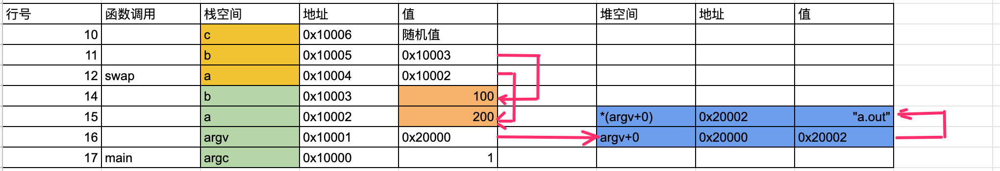</img>

神奇！`swap`内的操作改变了 `main`函数里`a`,`b`的状态。（好吧，也没那么神奇， 指针就是做这件事的。）

<br/>
7. 最后，需要注意的是，函数调用中，改变指针指向的内容才能影响到函数外的效果，如果是改变指针本身，和值传递的效果是一样的。看如下示例代码, `times2`把传入参数翻倍。
```c
  1 #include <stdio.h>
  2 #include <stdlib.h>
  3
  4 void times2( int* a ) {
  5   int* c = malloc(sizeof(int));
  6   *c = *a * 2;
  7   a = c;
  8 }
  9
 10 int main(int argc, char** argv) {
 11     int a = 100;
 12     printf( "a=%d\n", a );
 13 }
```
<br/>
9. 虽然使用了指针传入，最终`main`函数中的`a`没有改变。

> % ./a.out
> a=100

<br/>
10. 当程序执行到第`5`行时，内存布局看起来是这样的（和实际进程相比做了大量简化）
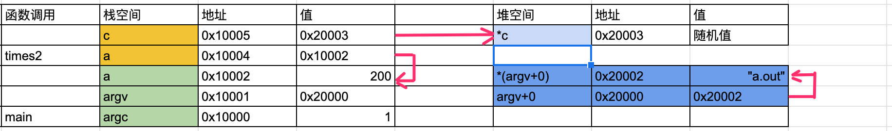</img>

<br/>
11. 当程序执行到第`7`行时，内存布局看起来是这样的（和实际进程相比做了大量简化）, 给`times2`函数中指针`a`赋新的值没有改变`main`函数中`a`的值。
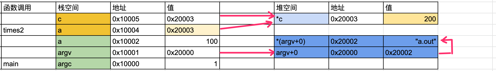</img>
<br/>
12. 这段代码要工作，需要更新第`7`行, 改变`times`函中`a`指针指向的值，而不是`a`指针的值。 这个图省略了，实际效果和图6类似：

```c
  1 #include <stdio.h>
  2 #include <stdlib.h>
  3
  4 void times2( int* a ) {
  5   int* c = malloc(sizeof(int));
  6   *c = *a * 2;
  7   *a = *c;
  8 }
  9
 10 int main(int argc, char** argv) {
 11     int a = 100;
 12     printf( "a=%d\n", a );
 13 }
```

## 结论

1. 函数调用有值传递和指针传递两种，如果要改变传入参数的值，需要使用指针传递参数。
2. 深入函栈帧栈的原理，只有值传递一种方式。指针传递其实也遵循值传递的规则。
3. 对于指针，要区分改变的是指针的值（一个地址），还是指针所指向的值（指针值所在的数据）。对于多级指针进行递归的指针分析。
